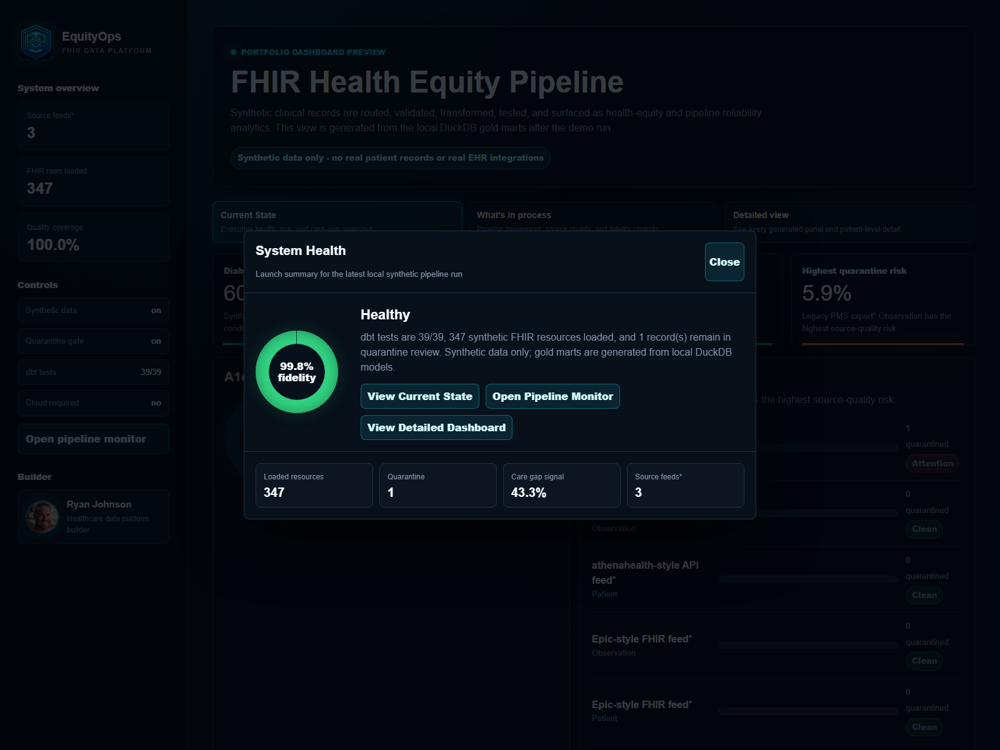
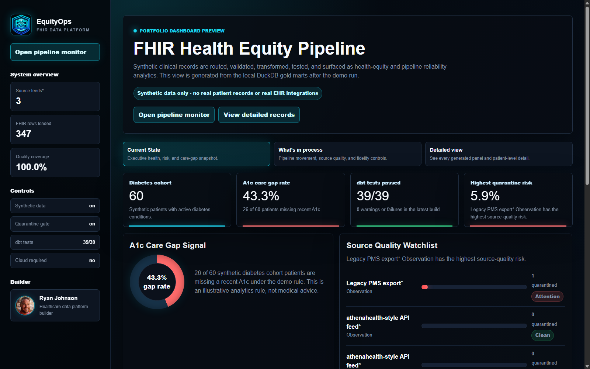
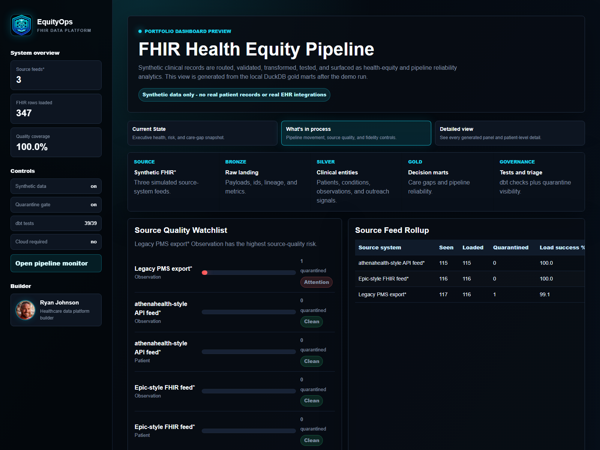
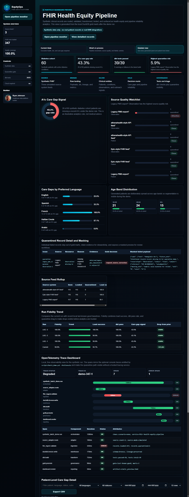
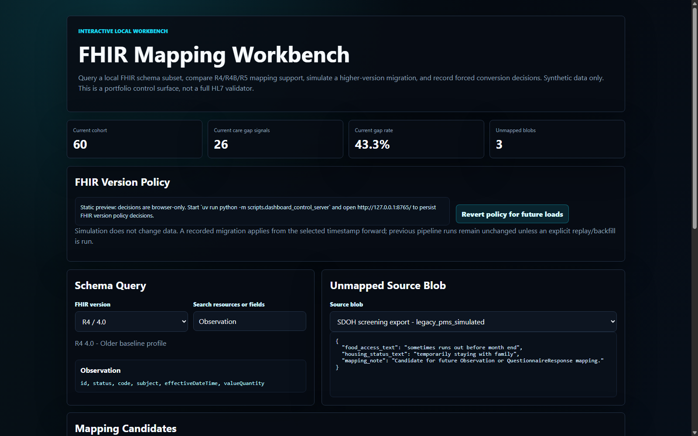
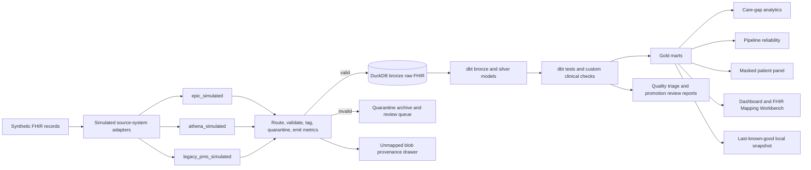
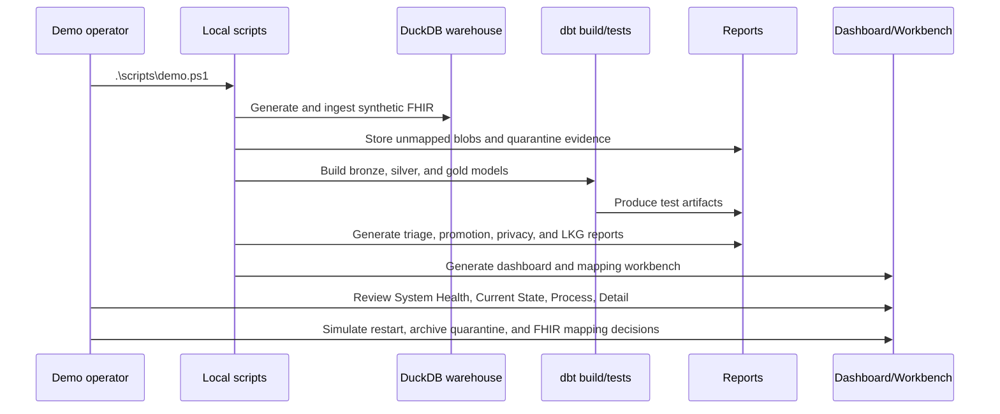
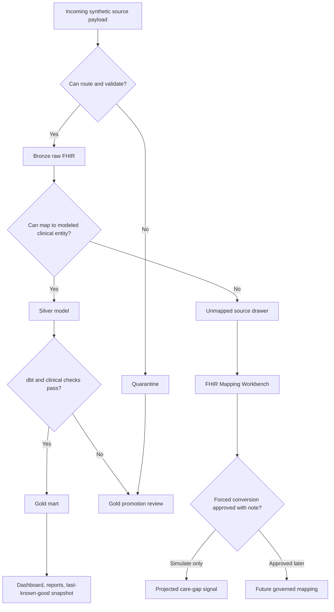

# FHIR Health Equity Pipeline

<p align="center">
  
</p>

Local-first synthetic healthcare data platform that turns FHIR-shaped records into tested dbt models, care-gap marts, pipeline reliability metrics, and a data quality triage report.

This project is intentionally small, low-cost, and runnable. It demonstrates the data platform patterns behind public healthcare analytics without using real patient data, paid cloud services, or real EHR vendor integrations.

## TL;DR

This repo is a portfolio-grade healthcare data engineering demo. It uses synthetic FHIR-shaped data to show how multi-source clinical records can be ingested, validated, quarantined, modeled with dbt, tested, privacy-masked, and surfaced in stakeholder-ready dashboards.

Run `powershell -ExecutionPolicy Bypass -File .\scripts\run_demo_dashboard.ps1`, then open `http://127.0.0.1:8765/`. The generated artifacts are `dashboards/static_preview.html` and `dashboards/fhir_mapping_workbench.html`.

What to notice:

- 347 synthetic FHIR resources across 60 synthetic patients.
- 39 dbt tests across bronze, silver, and gold models.
- Dashboard views for current health, in-process operations, and detailed patient-level analysis.
- Pipeline monitor with top-level launch button, simulated restart, slow-run, quarantine archive, deterministic synthetic-load deltas, and event log controls.
- OpenTelemetry Trace Dashboard showing span status, duration, attributes, and quarantine/error paths.
- FHIR Mapping Workbench for R4/R4B/R5 mapping decisions and forced-conversion notes.
- Privacy masking, row-level quarantine detail, last-known-good snapshots, unmapped blob provenance, OpenTelemetry-style traces, and chaos injection.

## Big 5 Showcase Features

1. **Synthetic multi-source FHIR pipeline**: Generates deterministic synthetic FHIR-shaped records, simulates multiple source adapters, validates payloads, lands raw records in DuckDB bronze, and quarantines invalid records with lineage.
2. **dbt quality gates and gold marts**: Builds bronze, silver, and gold models, runs 39 dbt tests plus a custom A1c plausibility check, and creates care-gap, reliability, and masked patient-panel marts.
3. **Operational dashboard and pipeline monitor**: Provides a three-view dark dashboard with a launch health modal, top-level pipeline monitor, Current State, What's in process, Detailed view, hover windows, run fidelity trend, OpenTelemetry Trace Dashboard, restart simulation, deterministic synthetic-load deltas, slow-run monitor, and quarantine archive action.
4. **FHIR Mapping Workbench**: Supports R4/R4B/R5 schema lookup, unmapped blob review, simulate-but-don't-apply migration, and forced-conversion decisions with audit notes.
5. **Governance, privacy, and resilience artifacts**: Demonstrates a gold-promotion review queue, row-level failed-record masking, unmapped blob provenance drawer, PHI-minimization report, last-known-good snapshots, OpenTelemetry-style console traces, and bounded chaos injection.

## Dashboard Preview

### Launch System Health



The dashboard opens with this health check so a reviewer can immediately see run fidelity, loaded resources, quarantine count, care-gap signal, and source feed count. Use it to jump into Current State, the Pipeline Monitor, or the Detailed Dashboard.

### Current State



Use Current State for the executive scan: cohort size, care-gap rate, dbt health, quarantine risk, care-gap signal, source-quality watchlist, and run fidelity trend.

### What's In Process



Use What's in process for operational review: pipeline stages, source feed rollup, source-quality watchlist, OTel trace waterfall, and fidelity trend. The Pipeline Monitor button opens simulated restart, slow-run, local synthetic-load, and quarantine archive controls.

### Detailed View



Use Detailed view when you want everything: English-first language segmentation, age-band distribution, failed-record masking detail, source rollups, fidelity trend, OTel tracing, and the patient-level care-gap table with search, filters, date range, paging, sorting, CSV export, and a single-record `View` modal with masked analytics fields.

## Mapping Workbench Preview



Use the FHIR Mapping Workbench to compare R4/R4B/R5 schema support, inspect unmapped blob candidates, simulate a higher-version migration, choose a forced FHIR target type such as Observation, QuestionnaireResponse, ServiceRequest, Communication, DocumentReference, Extension, or Basic, and record forced conversion notes with an audit rationale.

## What This Project Demonstrates

- Synthetic FHIR ingestion from simulated source systems.
- Live source-to-FHIR-to-model mapping traces for micro-batch demos.
- Raw bronze landing with source lineage.
- Quarantine handling for invalid records.
- Row-level failed-record detail with masked payload previews for stewardship review.
- Single-patient record inspection from the detailed care-gap table.
- A gold-promotion review queue for records that should not feed dashboard-ready marts.
- An unmapped source drawer for blob data retained for provenance and future semantic mapping.
- Privacy-masked analytics marts and a PHI-minimization report using synthetic data.
- Last-known-good local data release snapshots after successful runs.
- Optional OpenTelemetry console tracing, dashboard trace visualization, and bounded chaos injection for pipeline observability demos.
- A dashboard monitor modal with simulated restart actions for stalled pipeline workflows.
- Deterministic synthetic-load variation so repeated local runs produce visible care-gap and reliability deltas.
- An interactive FHIR Mapping Workbench for version-aware schema lookup, mapping simulation, and forced-conversion notes.
- A three-view dashboard layout: Current State, What's in process, and Detailed view.
- dbt bronze, silver, and gold models.
- dbt tests for identity, references, accepted values, and clinical plausibility.
- Dashboard-ready marts for diabetes care gaps and pipeline reliability.
- A Markdown quality triage report generated from dbt artifacts and ingestion metrics.
- Platform leadership artifacts for architecture decisions, KPIs, cost, and operating model.

## Healthcare Problem

Healthcare organizations often receive clinical data from multiple EHR, practice-management, and integration feeds. Even when the data is FHIR-shaped, each source can differ in completeness, coding, timing, and operational quality.

This repo asks:

> Can synthetic multi-source FHIR data be governed, tested, modeled, and converted into trustworthy analytics for care gaps, health equity, and pipeline reliability?

## Architecture



## Demo Flow



## Data Stewardship Flow



## Quickstart

This repo uses `uv` so the local Python environment can be created consistently.

On Windows:

```powershell
.\scripts\demo.ps1
```

If PowerShell blocks local scripts, use the one-command launcher with a process-scoped bypass. This does not require Administrator privileges.

```powershell
powershell -ExecutionPolicy Bypass -File .\scripts\run_demo_dashboard.ps1
```

That launcher runs the demo, starts the local dashboard control server, and opens `http://127.0.0.1:8765/`.

On systems with `make`:

```bash
make demo
```

The demo command:

1. Generates deterministic synthetic FHIR-shaped NDJSON.
2. Loads valid resources into DuckDB bronze tables.
3. Quarantines one intentionally invalid record.
4. Runs `dbt build`.
5. Writes `reports/data_quality_triage.md`.
6. Writes `dashboards/static_preview.html`.

To run the lightweight portfolio contract tests:

```powershell
uv run python -m unittest discover -s tests
```

To watch the same synthetic data land in micro-batches:

```powershell
.\scripts\batch_demo.ps1
```

The batch demo processes three small source batches, prints cumulative ingestion metrics after each batch, then rebuilds dbt models, the triage report, and the dashboard preview.

To run the dashboard with a real local button that loads the next synthetic batch, start the local-only control server:

```powershell
uv run python -m scripts.dashboard_control_server
```

Then open `http://127.0.0.1:8765/`, choose `Open pipeline monitor`, and click `Run next synthetic load`. The first click advances from the default 60-patient panel to 120 synthetic patients, applies a deterministic variation seed so care-gap signals can move, refreshes generated reports and dashboard artifacts, and reloads the served dashboard with cache-busting. Later clicks advance to 180, 240, and 300 patients. The button is intentionally local-only; the static HTML remains read-only when opened directly or viewed on GitHub.

To show each synthetic FHIR resource as it maps toward analytics models:

```powershell
.\scripts\batch_demo.ps1 -TraceMappings
```

The trace prints the simulated source system, FHIR resource type, source JSON paths, dbt-facing model columns, and any quarantine reason.

To emit local OpenTelemetry spans and inject a bounded synthetic failure:

```powershell
.\scripts\batch_demo.ps1 -OtelConsole -ChaosScenario missing_id
```

This writes console spans for batch processing, source files, loaded resources, quarantined resources, and the injected chaos event. The dashboard also includes an OpenTelemetry Trace Dashboard panel that visualizes the same local span pattern without requiring a paid observability service.

To generate a larger scenario-rich dataset with expected real-world data issues:

```powershell
.\scripts\scenario_demo.ps1 -PatientCount 250
```

This path intentionally creates data quality blockers, writes triage and promotion-review artifacts, and preserves the previous last-known-good pointer unless the scenario run meets promotion rules.

To open the interactive mapping workbench after a demo run:

```powershell
Start-Process .\dashboards\fhir_mapping_workbench.html
```

The workbench lets an operator query the local FHIR schema subset, choose R4/R4B/R5, inspect mapping candidates for unmapped blobs, simulate a migration without applying it, and record a forced conversion decision with an audit note. When served through `scripts/dashboard_control_server.py`, migration decisions persist to `data/work/fhir_version_policy.json` and refresh `reports/fhir_version_policy.md`. Version changes apply from the selected timestamp forward; previous pipeline runs remain immutable unless an explicit replay/backfill is run. The version labels follow HL7's published FHIR version sequence: R4 `4.0`, R4B `4.3`, and R5 `5.0`.

To generate dbt catalog and lineage artifacts locally:

```powershell
Push-Location dbt_transforms
uv run dbt docs generate --profiles-dir ../dbt_profiles
Pop-Location
```

## How to Read This Repo

Start with the runnable path, then read the platform story around it:

1. `scripts/generate_synthea_sample.py` creates a deterministic multi-patient FHIR-shaped fixture.
2. `scripts/ingest_fhir.py` simulates source routing, validation, bronze landing, quarantine, and ingestion metrics.
3. `scripts/ingest_unmapped_blobs.py` stores unmodeled source blobs for provenance and future semantic mapping.
4. `scripts/review_gold_promotion.py` creates a decision queue for records blocked from gold marts.
5. `dbt_transforms/models/bronze/` mirrors the raw landed tables for dbt.
6. `dbt_transforms/models/silver/` normalizes FHIR resources into analytics-friendly entities.
7. `dbt_transforms/models/gold/` turns those entities into stakeholder-facing marts, including masked analytics views.
8. `dbt_transforms/models/schema.yml` and `dbt_transforms/tests/` define the quality gates.
9. `scripts/triage_quality_failures.py` converts dbt artifacts and quarantine metrics into a Markdown report.
10. `scripts/version_data_release.py` snapshots successful runs as local last-known-good releases.
11. `scripts/fhir_version_policy.py` records local FHIR version decisions and writes a forward-effective policy report.
12. `dashboards/metabase_sql/` contains saved SQL questions for dashboarding.
13. `dashboards/static_preview.html` provides a generated stakeholder-facing dashboard preview.
14. `dashboards/fhir_mapping_workbench.html` provides an interactive version-aware mapping workbench.
15. `docs/` explains the architecture, tradeoffs, KPIs, cost story, and operating model.

For a guided explanation, read `docs/repo-walkthrough.md`.

For interview preparation, read `docs/interview-walkthrough.md`.

For a feature-complete demonstration path, read `docs/full-feature-demo-script.md`.

## Current Demo Results

The v1 walking skeleton currently loads 347 valid synthetic FHIR resources across 60 synthetic patients and quarantines 1 intentionally invalid Observation. The dbt project builds 11 models and runs 39 tests.

The care-gap mart includes a diabetes cohort with A1c freshness, preferred language, postal code, age band, and outreach channel. The reliability mart shows load and quarantine rates by simulated source system and resource type.

Open `dashboards/static_preview.html` after running the demo to view the current static dashboard preview.

## Feature Coverage Sanity Check

| Suggested capability | Current repo coverage |
| --- | --- |
| Synthetic-only FHIR pipeline | Deterministic local synthetic FHIR records with simulated source adapters only. |
| Larger viable data sample | Default panel is 60 synthetic patients and 347 loaded FHIR resources. |
| Professional dark dashboard | Generated dark dashboard with custom logo, author image, current screenshots, stakeholder-ready copy, and three dashboard views. |
| Real-time style monitoring | Pipeline Monitor modal includes a slow staged run, restart actions, a local synthetic-load control button with deterministic run variation, and event log. |
| Quarantine operations | Invalid records are quarantined, reviewed for gold promotion, and can be dismissed into a simulated archive export. |
| FHIR version mapping | Workbench supports R4, R4B, and R5 schema lookup, simulation, forced FHIR target types, forced conversion notes, local policy persistence, and future-effective revert decisions. |
| Data quality and fidelity | dbt tests, triage report, run fidelity trend, and last-known-good snapshots are included. |
| Privacy posture | Masked mart and PHI-minimization report demonstrate synthetic-data masking patterns without claiming HIPAA compliance. |
| Provenance for unmapped blobs | Unmapped source drawer retains blob hashes and semantic hints for future mapping. |
| Interactive patient detail | Patient detail supports search, filters, date range, paging, sorting, CSV export, and single-record inspection with masked analytics fields. |
| Observability and chaos | Optional OpenTelemetry console spans, an OTel Trace Dashboard panel, and bounded chaos injection are available in the batch demo. |

## Portfolio Artifacts

- `dashboards/static_preview.html`: generated dark-theme dashboard preview with top pipeline monitor action, hover windows, live monitor simulation, quarantine archive action, failed-record masking detail, run fidelity trend, and sortable/exportable patient detail.
- `dashboards/fhir_mapping_workbench.html`: interactive local FHIR mapping workbench.
- `scripts/dashboard_control_server.py`: local-only dashboard server that enables the `Run next synthetic load` button.
- `scripts/fhir_version_policy.py`: local demo policy recorder for FHIR version selection, forced mappings, and future-effective reverts.
- `dashboards/screenshots/dashboard-system-health.png`: launch modal screenshot.
- `dashboards/screenshots/static-preview.png`: screenshot for GitHub preview.
- `dashboards/screenshots/dashboard-process-view.png`: operational process view screenshot.
- `dashboards/screenshots/dashboard-detail-view.png`: detailed dashboard screenshot.
- `dashboards/screenshots/fhir-mapping-workbench.png`: screenshot for the mapping workbench.
- `reports/data_quality_triage.md`: generated quality and quarantine report.
- `reports/fhir_version_policy.md`: generated FHIR version policy report for timestamp-forward migration decisions.
- `reports/gold_promotion_review.md`: generated review queue for data blocked from gold marts.
- `reports/gold_promotion_decisions.jsonl`: machine-readable promotion decisions.
- `reports/privacy_masking_report.md`: generated PHI-minimization and masking report.
- `reports/unmapped_source_drawer.md`: generated provenance drawer for unmodeled blobs.
- `reports/last_known_good.md`: generated pointer summary for the latest promoted local run.
- `docs/repo-walkthrough.md`: layer-by-layer technical walkthrough.
- `docs/interview-walkthrough.md`: interview talk track and discussion guide.
- `docs/demo-script.md`: step-by-step interview demo script.
- `docs/full-feature-demo-script.md`: end-to-end demo script covering every major feature.
- `docs/architecture-decisions.md`: concise platform tradeoffs.
- `docs/cost-and-roi.md`: cost-aware architecture framing.
- `docs/operating-model.md`: ownership, intake, incident response, and team standards.

## Data Model

### Bronze

Bronze preserves raw FHIR payloads with minimal transformation:

- `source_system`
- `resource_type`
- `resource_id`
- `ingested_at`
- `source_file`
- `raw_json`

It also stores ingestion metrics:

- records seen
- records loaded
- records quarantined
- processed timestamp

### Silver

Silver normalizes selected FHIR resources into analytics-friendly models:

- `stg_fhir_patients`
- `stg_fhir_encounters`
- `stg_fhir_conditions`
- `stg_fhir_observations`
- `stg_fhir_appointments`
- `stg_fhir_communications`

### Gold

Gold models are dashboard-ready:

- `mart_diabetes_care_gaps`
- `mart_pipeline_reliability`
- `mart_masked_patient_panel`

## Data Quality and Governance

dbt tests check:

- required identifiers
- patient uniqueness
- referential integrity back to patients
- accepted source systems
- accepted resource types
- accepted A1c observation codes and units
- clinically plausible A1c values

The ingestion layer also quarantines records that fail basic routing requirements before they reach analytics models.

The gold-promotion review script adds a human-in-the-loop stewardship point. In default mode it writes recommended decisions automatically; in interactive mode it prompts for whether to request source correction, fix mappings, reject from gold, accept a monitored exception, or defer.

The privacy masking report demonstrates tokenization and minimization patterns on synthetic data. It does not claim HIPAA compliance; production HIPAA programs still require formal administrative, physical, and technical controls.

The dashboard preview includes a local pipeline monitor modal. The restart controls are intentionally simulated: they log browser-side restart requests and represent the runbook actions an operator would take in a real orchestrated environment.

## Role Alignment

This project is designed to support a healthcare data engineering leadership story:

- Architecture: local-first design with clear cloud scaling path.
- Data quality: dbt tests plus quarantine and triage reporting.
- Governance: source lineage, accepted values, and documented assumptions.
- Cost awareness: DuckDB first, optional cloud warehouse patterns later.
- Stakeholder value: care-gap and health-equity analytics.
- Operating maturity: pipeline reliability mart, platform KPIs, and operating model docs.

## Cloud Platform Readiness

The v1 demo runs locally with DuckDB. The repository includes a `profiles.example.yml` and documentation for how the same pattern could map to BigQuery, Snowflake, or Databricks.

This repo does not claim to run production Spark, Kafka, Airflow, Snowflake, Databricks, or BigQuery in v1.

## What This Project Does Not Claim

This repository does not contain real patient data, real EHR integrations, or production HIPAA controls. It does not claim hands-on production use of Epic, eClinicalWorks, NextGen, athenahealth, Rhapsody, or any commercial integration engine.

Instead, it demonstrates the engineering pattern: source routing, raw landing, tested transformations, analytics marts, dashboard-ready outputs, operational telemetry, and transparent data quality reporting.

## What Would Make This Production Usable

This repo is a portfolio-grade local reference implementation. A production version would need additional engineering, governance, and compliance work:

- Real source contracts: approved interface specifications, source ownership, data-sharing agreements, and change-management processes.
- Formal FHIR validation: profile validation, terminology services, code-system governance, and versioned implementation guides.
- Production orchestration: scheduled and event-driven runs, retries, backfills, dependency management, and idempotent job design.
- Scalable storage and compute: cloud object storage, warehouse/lakehouse deployment, partitioning, retention policies, and cost controls.
- Security and access control: least-privilege IAM, secrets management, encryption, network controls, audit logs, and environment separation.
- HIPAA/PHI program controls: risk assessment, policies, business associate agreements, access reviews, incident response, and privacy/security officer oversight.
- Observability and operations: centralized logs, traces, metrics, alerting, SLAs/SLOs, on-call runbooks, and operational dashboards.
- Data quality governance: data contracts, stewardship queues, exception workflows, quality thresholds, and signed promotion rules for gold marts.
- Release management: CI/CD, migrations, automated rollback, last-known-good restore procedures, and production deployment approvals.
- Clinical and business validation: stakeholder review of care-gap logic, equity segmentation, outreach rules, and downstream reporting use cases.

## Repository Layout

```text
data/                 Synthetic samples, raw inputs, local warehouse, and quarantined records.
dbt_transforms/       dbt project for bronze, silver, and gold models.
dbt_profiles/         Local dbt profile for the demo.
dashboards/           Dashboard SQL, screenshots, and dashboard notes.
docs/                 Architecture notes and platform leadership artifacts.
reports/              Generated quality and demo reports.
scripts/              Data generation, ingestion, and quality-triage scripts.
```

## Roadmap

- V1: Local DuckDB and dbt demo with care-gap mart, reliability mart, and quality report.
- V1.5: Add outreach readiness, richer source variation, saved dashboard screenshots, and dbt docs artifacts.
- V2: Add optional cloud execution patterns, orchestration pattern, formal FHIR validation, and optional AI-assisted triage.

## License

MIT
